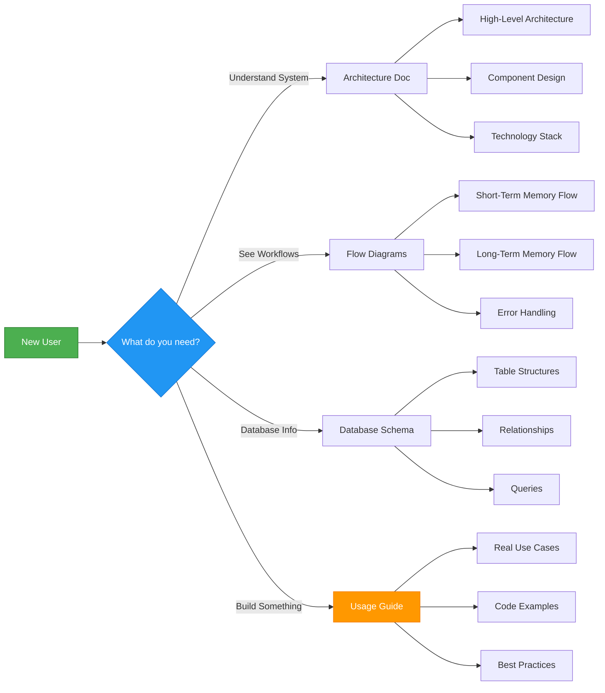
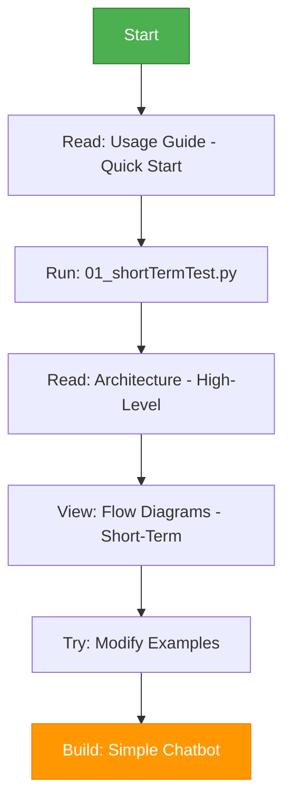
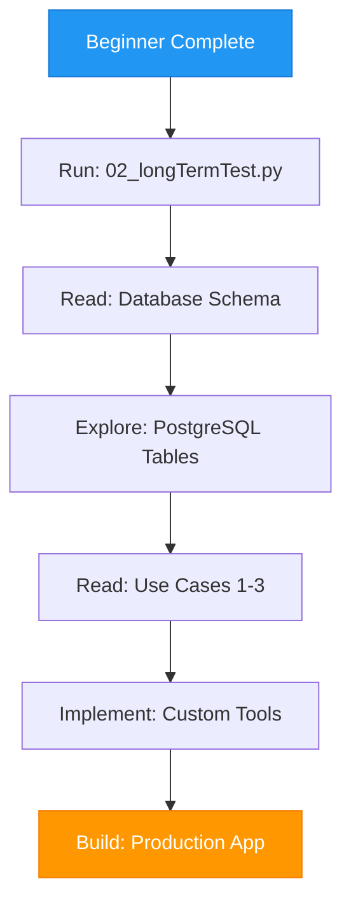
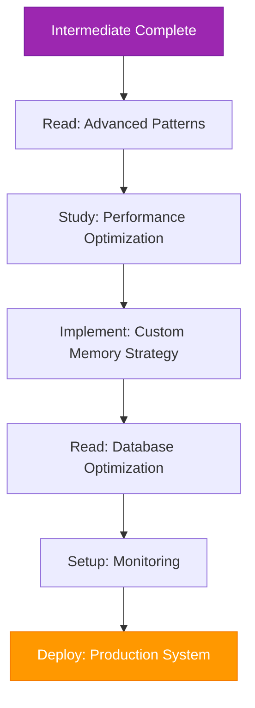

# Documentation Index

Welcome to the ReAct Agent Memory System documentation!

## 📚 Documentation Structure

This documentation provides comprehensive guidance on understanding, implementing, and deploying the ReAct Agent Memory System.

### Quick Navigation

| Document | Description | Best For |
|----------|-------------|----------|
| **[Usage Guide](./usage-guide.md)** | Working examples with verified code | Developers starting with the project |
| **[Architecture](./architecture.md)** | System architecture and design patterns | Understanding system design |
| **[Flow Diagrams](./flow-diagrams.md)** | Detailed flowcharts for all operations | Visual learners |
| **[Database Schema](./database-schema.md)** | Verified database schema (6 tables) | Database administrators |

---

## 🚀 Getting Started

### New to the Project?

1. **Start here**: [Usage Guide - Quick Start](./usage-guide.md#quick-start)
2. **Understand the basics**: [Architecture - Overview](./architecture.md#high-level-architecture)
3. **Try examples**: [Usage Guide - Working Examples](./usage-guide.md#working-example-1-short-term-memory)

### Looking for Specific Information?

#### Understanding How It Works

#### Implementation Questions

| Question | Document | Section |
|----------|----------|---------|
| How do I set up the environment? | [Usage Guide](./usage-guide.md) | Quick Start |
| What's the data flow? | [Flow Diagrams](./flow-diagrams.md) | Short-Term/Long-Term Flow |
| How does memory work? | [Architecture](./architecture.md) | Memory Architecture |
| What tables are created? | [Database Schema](./database-schema.md) | Database Overview |
| How do I handle errors? | [Flow Diagrams](./flow-diagrams.md) | Error Handling Flow |
| What are best practices? | [Usage Guide](./usage-guide.md) | Best Practices |

---

## 📖 Document Summaries

### 1. [Usage Guide](./usage-guide.md)

**Complete practical guide with real-world examples**

**Contents:**
- ✅ Quick start installation
- ✅ 5 complete use cases with code:
  - Customer Support Chatbot
  - Personal Assistant
  - E-commerce Shopping Assistant
  - Educational Tutor
  - Healthcare Assistant
- ✅ Advanced patterns
- ✅ Best practices
- ✅ Troubleshooting

**Key Features:**
- Copy-paste ready code
- Expected output examples
- Common pitfalls and solutions
- Security recommendations

**Start with this if you want to:** Build something immediately

---

### 2. [Architecture](./architecture.md)

**Deep dive into system design and architecture**

**Contents:**
- 🏗️ High-level architecture diagrams
- 🏗️ Component architecture
- 🏗️ Data flow sequences
- 🏗️ Technology stack
- 🏗️ Memory architecture
- 🏗️ ReAct agent workflow
- 🏗️ Deployment architecture

**Key Features:**
- 8+ Mermaid diagrams
- Design principles explained
- Performance considerations
- Scalability patterns

**Start with this if you want to:** Understand how it works under the hood

---

### 3. [Flow Diagrams](./flow-diagrams.md)

**Visual representation of all system workflows**

**Contents:**
- 📊 Short-term memory complete flow
- 📊 Long-term memory complete flow
- 📊 Thread state management
- 📊 Message trimming flow
- 📊 Memory storage flow
- 📊 Memory retrieval flow
- 📊 Cross-session patterns
- 📊 Streaming vs non-streaming
- 📊 Error handling flow
- 📊 Configuration flow

**Key Features:**
- 10+ detailed flowcharts
- Step-by-step execution paths
- Decision trees
- Error handling workflows

**Start with this if you want to:** Visualize the workflows

---

### 4. [Database Schema](./database-schema.md)

**Complete database documentation**

**Contents:**
- 💾 Database overview (ERD)
- 💾 Short-term memory schema
- 💾 Long-term memory schema
- 💾 Table structures
- 💾 Relationships
- 💾 Data access patterns
- 💾 Indexes and optimization
- 💾 Migration scripts
- 💾 Monitoring queries

**Key Features:**
- Entity-Relationship Diagrams
- UML class diagrams
- Example data
- Performance optimization
- Sample SQL queries

**Start with this if you want to:** Work with the database directly

---

## 🎯 Use Case Mapping

Find the right documentation for your scenario:

### Building a Chatbot

1. **Start**: [Usage Guide - Customer Support Use Case](./usage-guide.md#use-case-1-customer-support-chatbot)
2. **Understand**: [Architecture - ReAct Workflow](./architecture.md#react-agent-workflow)
3. **Visualize**: [Flow Diagrams - Complete Execution](./flow-diagrams.md#complete-execution-flow)

### Implementing Memory

1. **Start**: [Usage Guide - Quick Start](./usage-guide.md#quick-start)
2. **Understand**: [Architecture - Memory Architecture](./architecture.md#memory-architecture)
3. **Database**: [Database Schema - Memory Tables](./database-schema.md#short-term-memory-schema)
4. **Visualize**: [Flow Diagrams - Memory Flows](./flow-diagrams.md#long-term-memory-flow-02_longtermtestpy)

### Troubleshooting Issues

1. **Common Issues**: [Usage Guide - Troubleshooting](./usage-guide.md#troubleshooting)
2. **Error Flows**: [Flow Diagrams - Error Handling](./flow-diagrams.md#error-handling-flow)
3. **Database Issues**: [Database Schema - Monitoring](./database-schema.md#monitoring--metrics)

### Optimizing Performance

1. **Best Practices**: [Usage Guide - Best Practices](./usage-guide.md#best-practices)
2. **Architecture**: [Architecture - Performance](./architecture.md#performance-considerations)
3. **Database**: [Database Schema - Optimization](./database-schema.md#performance-optimization)

---

## 🔍 Quick Reference

### Architecture Patterns

| Pattern | Description | Document |
|---------|-------------|----------|
| **ReAct Pattern** | Reasoning + Acting workflow | [Architecture](./architecture.md#react-agent-workflow) |
| **Memory Separation** | Short vs Long-term | [Architecture](./architecture.md#memory-architecture) |
| **Thread Isolation** | Per-conversation state | [Flow Diagrams](./flow-diagrams.md#thread-state-management) |
| **Namespace Organization** | Hierarchical memory | [Database Schema](./database-schema.md#namespace-structure) |

### Common Operations

| Operation | Code Location | Flow Diagram |
|-----------|---------------|--------------|
| **Store Memory** | [Usage Guide](./usage-guide.md#use-case-2-personal-assistant) | [Flow Diagrams](./flow-diagrams.md#long-term-memory-storage-flow) |
| **Retrieve Memory** | [Usage Guide](./usage-guide.md#use-case-3-e-commerce-shopping-assistant) | [Flow Diagrams](./flow-diagrams.md#long-term-memory-retrieval-flow) |
| **Trim Messages** | [Usage Guide](./usage-guide.md#3-performance-optimization) | [Flow Diagrams](./flow-diagrams.md#message-trimming-flow) |
| **Handle Errors** | [Usage Guide](./usage-guide.md#2-error-handling) | [Flow Diagrams](./flow-diagrams.md#error-handling-flow) |

### Database Tables

| Table | Purpose | Schema Document |
|-------|---------|-----------------|
| **checkpoints** | Short-term conversation state | [Database Schema](./database-schema.md#checkpoints-table) |
| **checkpoint_writes** | Incremental checkpoint updates | [Database Schema](./database-schema.md#checkpoint-writes-table) |
| **store** | Long-term cross-session memory | [Database Schema](./database-schema.md#store-table) |

---

## 💡 Learning Path

### Beginner Track

### Intermediate Track

### Advanced Track

---

## 🛠️ Tools & Technologies

This project uses the following technologies:

| Technology | Version | Purpose | Documentation |
|------------|---------|---------|---------------|
| **Python** | 3.8+ | Programming language | [Architecture](./architecture.md#technology-stack) |
| **LangGraph** | 1.0.2 | Agent orchestration | [Architecture](./architecture.md#component-architecture) |
| **LangChain** | 1.0.3 | LLM integration | [Architecture](./architecture.md#technology-stack) |
| **PostgreSQL** | 15 | Database | [Database Schema](./database-schema.md) |
| **Docker** | Latest | Containerization | [Usage Guide](./usage-guide.md#quick-start) |
| **OpenAI API** | - | Language model | [Usage Guide](./usage-guide.md#basic-configuration) |

---

## 📝 Contributing

Found an issue or have a suggestion? Here's how to contribute:

1. **Documentation Issues**: Open an issue describing what's unclear
2. **Code Examples**: Share your use cases and implementations
3. **Improvements**: Submit pull requests with enhancements

---

## 🔗 External Resources

- [LangGraph Official Documentation](https://langchain-ai.github.io/langgraph/)
- [LangGraph Memory Guide](https://langchain-ai.github.io/langgraph/agents/memory/)
- [LangChain Documentation](https://python.langchain.com/)
- [PostgreSQL Documentation](https://www.postgresql.org/docs/)
- [Mermaid Diagram Syntax](https://mermaid.js.org/)

---

## 📄 License

MIT License - See main repository for details.

---

## 📧 Support

- **Issues**: Create an issue in the GitHub repository
- **Questions**: Check [Usage Guide - Troubleshooting](./usage-guide.md#troubleshooting)
- **Discussions**: Join community discussions

---

**Last Updated**: 2025-01-11 (All documentation verified and updated)

**Documentation Version**: 2.0.0
