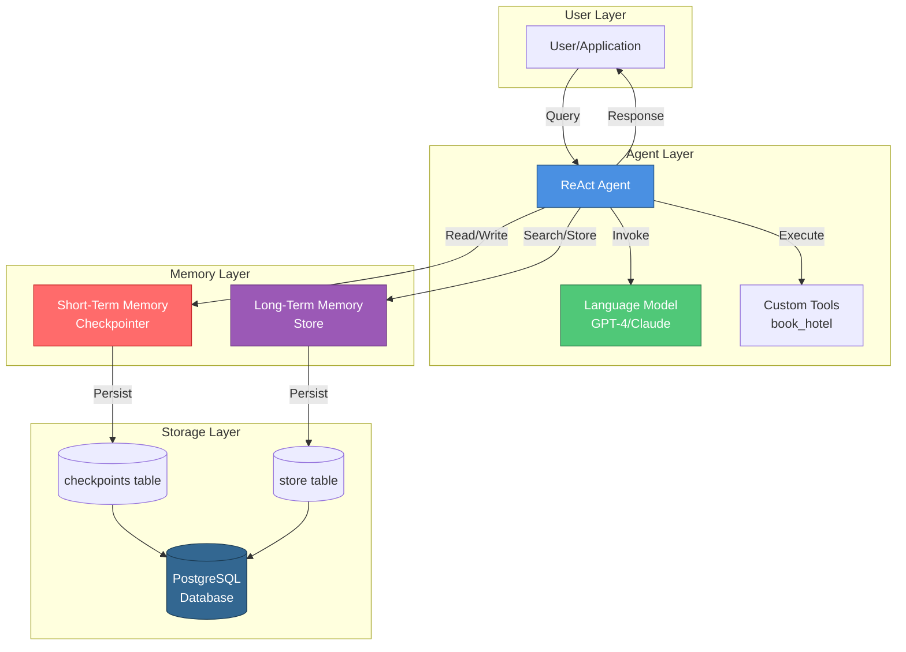
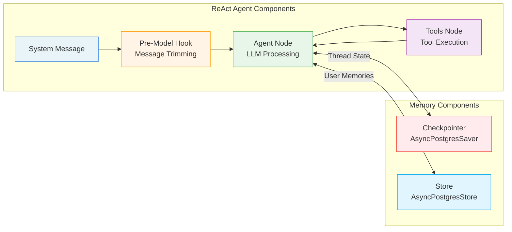
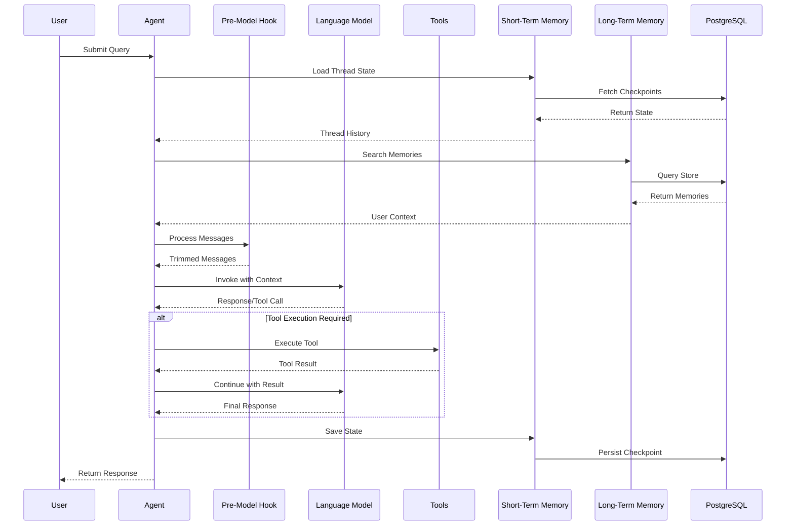
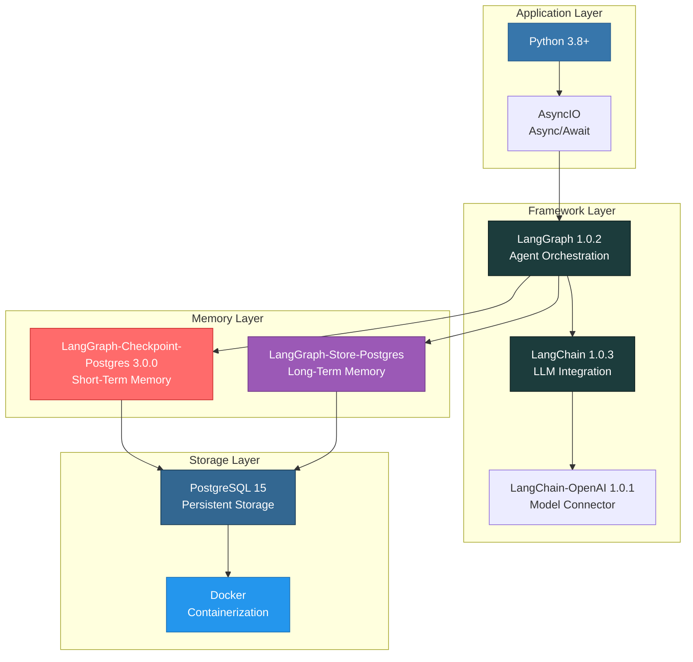
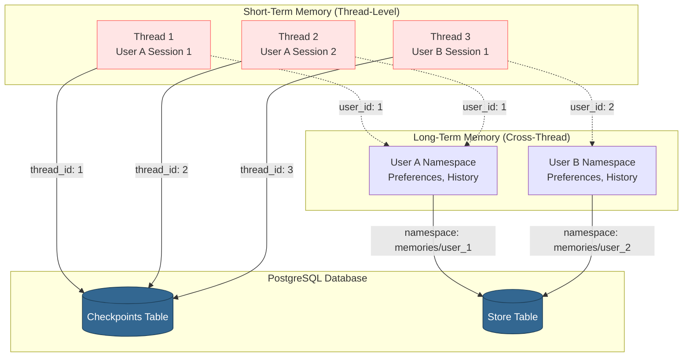
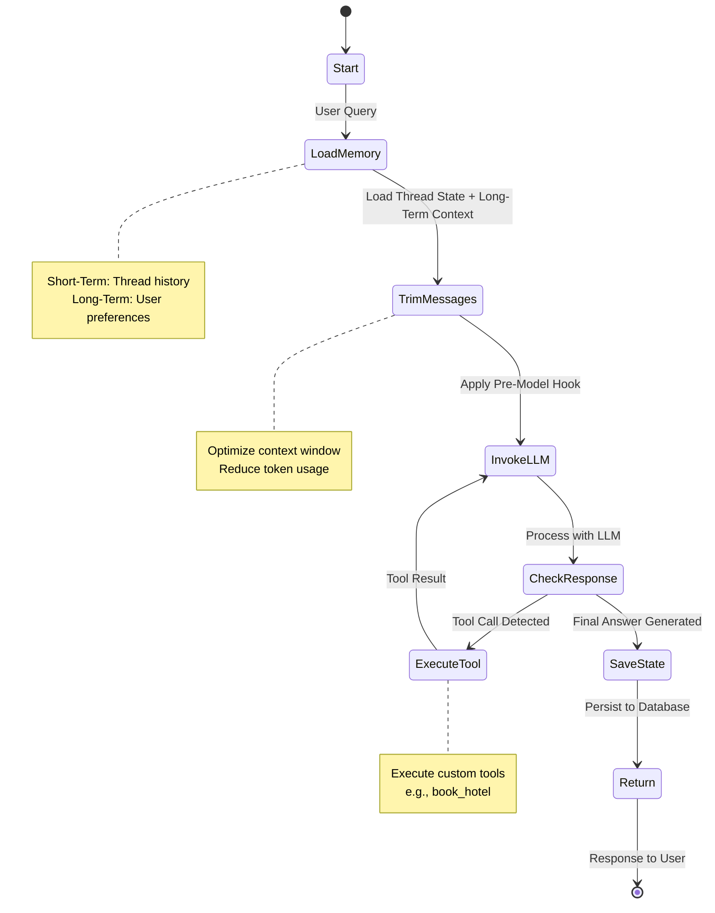
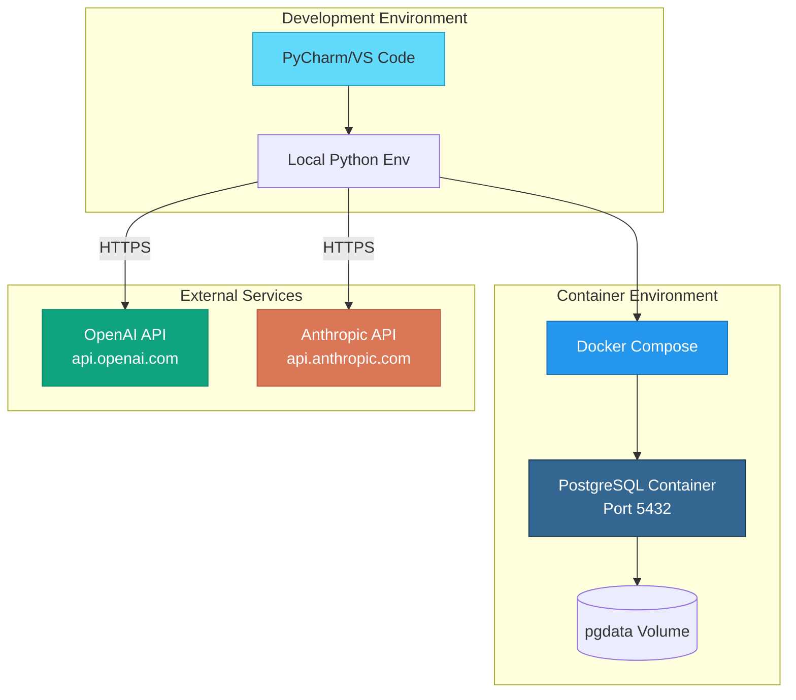

# System Architecture

**Last Updated**: 2025-01-11
**Verified Package Versions**: Yes

This document provides a comprehensive overview of the ReAct Agent Memory System architecture.

## High-Level Architecture

## Component Architecture

## Data Flow Architecture

## Technology Stack

## Memory Architecture

## ReAct Agent Workflow

## Deployment Architecture

## Key Design Principles

### 1. **Separation of Concerns**
- **Agent Logic**: Handles reasoning and tool orchestration
- **Memory Management**: Manages state persistence independently
- **Storage Layer**: Provides durable data persistence

### 2. **Asynchronous Processing**
- All database operations use `async/await` for non-blocking I/O
- Supports concurrent memory reads/writes
- Efficient resource utilization

### 3. **Modularity**
- Tools are easily pluggable
- Memory components can be swapped (e.g., Redis, SQLite)
- LLM providers are interchangeable

### 4. **Scalability**
- Thread-based isolation prevents state conflicts
- Namespace-based memory organization supports multi-tenancy
- PostgreSQL provides production-grade persistence

### 5. **Security**
- Environment variables for sensitive credentials
- `.gitignore` prevents credential leaks
- Database credentials should be rotated in production

## Performance Considerations

### Memory Trimming
The `pre_model_hook` function optimizes token usage by:
- Limiting conversation history to recent messages
- Reducing API costs
- Staying within context window limits

### Connection Pooling
PostgreSQL connections are managed efficiently through:
- Async context managers
- Automatic connection cleanup
- Connection reuse across operations

### Caching Strategy
- Short-term memory: Checkpoints cached per thread
- Long-term memory: Searchable index for fast retrieval
- Database indexes on frequently queried fields
