# Flow Diagrams

**Last Updated**: 2025-01-11

This document contains detailed flow charts for both short-term and long-term memory operations based on the actual codebase.

## Short-Term Memory Flow (01_shortTermTest.py)

### Complete Execution Flow

```mermaid
flowchart TD
    Start([Start Application]) --> LoadEnv[Load Environment Variables]
    LoadEnv --> InitLLM[Initialize LLM<br/>from .env config]
    InitLLM --> DefineTools[Define Custom Tools<br/>book_hotel]
    DefineTools --> ConnectDB[Connect to PostgreSQL<br/>localhost:5432]

    ConnectDB --> InitCheckpointer[Initialize AsyncPostgresSaver<br/>Short-Term Memory]
    InitCheckpointer --> SetupCheckpointer[Setup Database Tables<br/>checkpointer.setup]

    SetupCheckpointer --> CreateAgent[Create ReAct Agent<br/>+ LLM<br/>+ Tools<br/>+ System Message<br/>+ Checkpointer]

    CreateAgent --> SaveGraph{Save Graph<br/>Visualization?}
    SaveGraph -->|Yes| GenGraph[Generate graph.png]
    SaveGraph -->|No| DefineConfig
    GenGraph --> DefineConfig

    DefineConfig[Define Config<br/>thread_id: 1] --> UserInput[User Input<br/>e.g., What is my name?]

    UserInput --> LoadThread{Load Thread State}
    LoadThread -->|Thread Exists| LoadHistory[Load Conversation History<br/>from Database]
    LoadThread -->|New Thread| EmptyState[Empty State]

    LoadHistory --> TrimHook{Pre-Model Hook<br/>Enabled?}
    EmptyState --> TrimHook

    TrimHook -->|Yes| TrimMessages[Trim Messages<br/>Keep last 4 messages]
    TrimHook -->|No| InvokeLLM

    TrimMessages --> InvokeLLM[Invoke LLM<br/>with Context]

    InvokeLLM --> LLMResponse{LLM Response Type}

    LLMResponse -->|Tool Call| ParseTool[Parse Tool Call<br/>Extract: name, args]
    LLMResponse -->|Text Response| FinalAnswer

    ParseTool --> ExecuteTool[Execute Tool<br/>book_hotel]
    ExecuteTool --> ToolResult[Get Tool Result]
    ToolResult --> SendToLLM[Send Result to LLM]
    SendToLLM --> InvokeLLM

    FinalAnswer[Final Answer Generated] --> SaveCheckpoint[Save Checkpoint<br/>Persist to PostgreSQL]

    SaveCheckpoint --> ParseOutput[Parse Messages<br/>Display Details]
    ParseOutput --> PrintResponse[Print Final Response]
    PrintResponse --> End([End])

    style Start fill:#4CAF50,stroke:#2E7D32,color:#fff
    style InitCheckpointer fill:#FF6B6B,stroke:#C92A2A,color:#fff
    style CreateAgent fill:#4A90E2,stroke:#2E5C8A,color:#fff
    style SaveCheckpoint fill:#FF9800,stroke:#E65100,color:#fff
    style End fill:#F44336,stroke:#C62828,color:#fff
```

### Thread State Management

```mermaid
flowchart LR
    subgraph "First Interaction"
        direction TB
        U1[User: My name is Nelson] --> A1[Agent Response]
        A1 --> S1[(Save to Thread 1<br/>Checkpoint)]
    end

    subgraph "Second Interaction"
        direction TB
        L2[(Load Thread 1<br/>Previous Context)] --> U2[User: What is my name?]
        U2 --> A2[Agent: Your name is Nelson]
        A2 --> S2[(Update Thread 1<br/>Checkpoint)]
    end

    subgraph "Third Interaction"
        direction TB
        L3[(Load Thread 1<br/>Full History)] --> U3[User: Book a hotel]
        U3 --> T3[Tool: book_hotel]
        T3 --> A3[Agent: Booking confirmed]
        A3 --> S3[(Update Thread 1<br/>Checkpoint)]
    end

    S1 --> L2
    S2 --> L3

    style S1 fill:#FFE5E5,stroke:#FF6B6B
    style S2 fill:#FFE5E5,stroke:#FF6B6B
    style S3 fill:#FFE5E5,stroke:#FF6B6B
    style L2 fill:#E8F4F8,stroke:#4A90E2
    style L3 fill:#E8F4F8,stroke:#4A90E2
```

### Message Trimming Flow

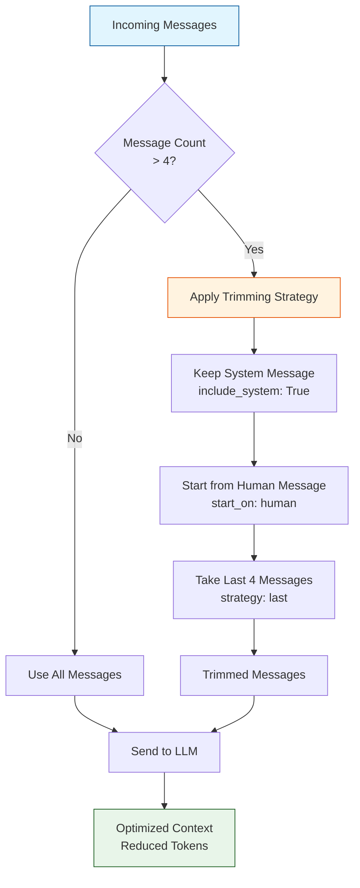

## Long-Term Memory Flow (02_longTermTest.py)

### Complete Execution Flow

```mermaid
flowchart TD
    Start([Start Application]) --> LoadEnv[Load Environment Variables]
    LoadEnv --> InitLLM[Initialize LLM]
    InitLLM --> DefineTools[Define Custom Tools]
    DefineTools --> ConnectDB[Connect to PostgreSQL]

    ConnectDB --> InitBoth[Initialize Both:<br/>1. AsyncPostgresSaver<br/>2. AsyncPostgresStore]
    InitBoth --> SetupBoth[Setup Database Tables<br/>+ Checkpoints<br/>+ Store]

    SetupBoth --> CreateAgent[Create ReAct Agent<br/>+ Checkpointer<br/>+ Store<br/>+ Pre-Model Hook]

    CreateAgent --> DefineConfig[Define Config<br/>thread_id: 1<br/>user_id: 1]

    DefineConfig --> ExtractUser[Extract User ID<br/>from Config]
    ExtractUser --> DefineNamespace[Define Namespace<br/>memories, user_id]

    DefineNamespace --> SearchMemories[Search Long-Term Memories<br/>store.asearch]

    SearchMemories --> MemoriesFound{Memories<br/>Found?}

    MemoriesFound -->|Yes| ExtractData[Extract Memory Data<br/>Join all values]
    MemoriesFound -->|No| NoMemories[info = No long-term memory]

    ExtractData --> BuildContext[Build Context String]
    NoMemories --> BuildContext

    BuildContext --> AugmentInput[Augment User Input<br/>with Memory Context]

    AugmentInput --> LoadThread{Load Thread State<br/>Short-Term Memory}

    LoadThread --> TrimHook[Pre-Model Hook<br/>Trim Messages]

    TrimHook --> InvokeLLM[Invoke LLM<br/>with Both Contexts]

    InvokeLLM --> LLMResponse{Response Type}

    LLMResponse -->|Tool Call| ExecuteTool[Execute Tool]
    LLMResponse -->|Text| FinalAnswer

    ExecuteTool --> ToolResult[Get Result]
    ToolResult --> SendToLLM[Send to LLM]
    SendToLLM --> InvokeLLM

    FinalAnswer[Final Answer] --> SaveCheckpoint[Save Short-Term<br/>Checkpoint]

    SaveCheckpoint --> StoreMemory{Store New<br/>Long-Term Memory?}

    StoreMemory -->|Yes| PutMemory[store.aput<br/>Save Memory]
    StoreMemory -->|No| ParseOutput

    PutMemory --> ParseOutput[Parse & Display Messages]
    ParseOutput --> PrintResponse[Print Final Response]
    PrintResponse --> End([End])

    style Start fill:#4CAF50,stroke:#2E7D32,color:#fff
    style InitBoth fill:#9C27B0,stroke:#6A1B9A,color:#fff
    style SearchMemories fill:#9B59B6,stroke:#6C3483,color:#fff
    style SaveCheckpoint fill:#FF6B6B,stroke:#C92A2A,color:#fff
    style PutMemory fill:#9B59B6,stroke:#6C3483,color:#fff
    style End fill:#F44336,stroke:#C62828,color:#fff
```

### Long-Term Memory Storage Flow

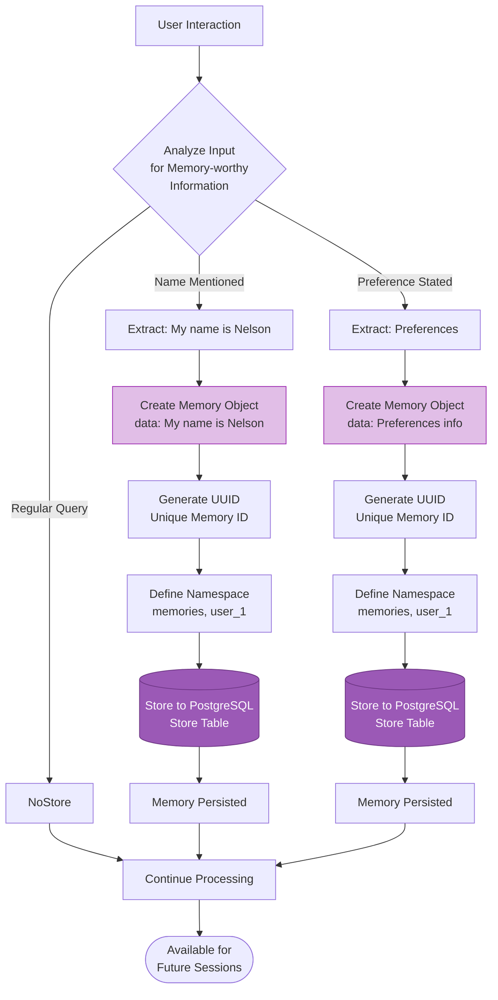

### Long-Term Memory Retrieval Flow

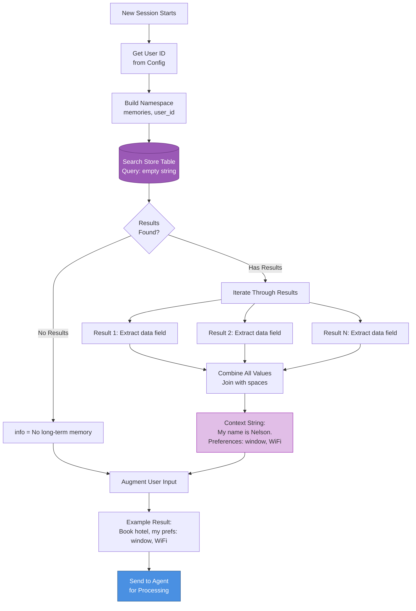

### Cross-Session Memory Pattern

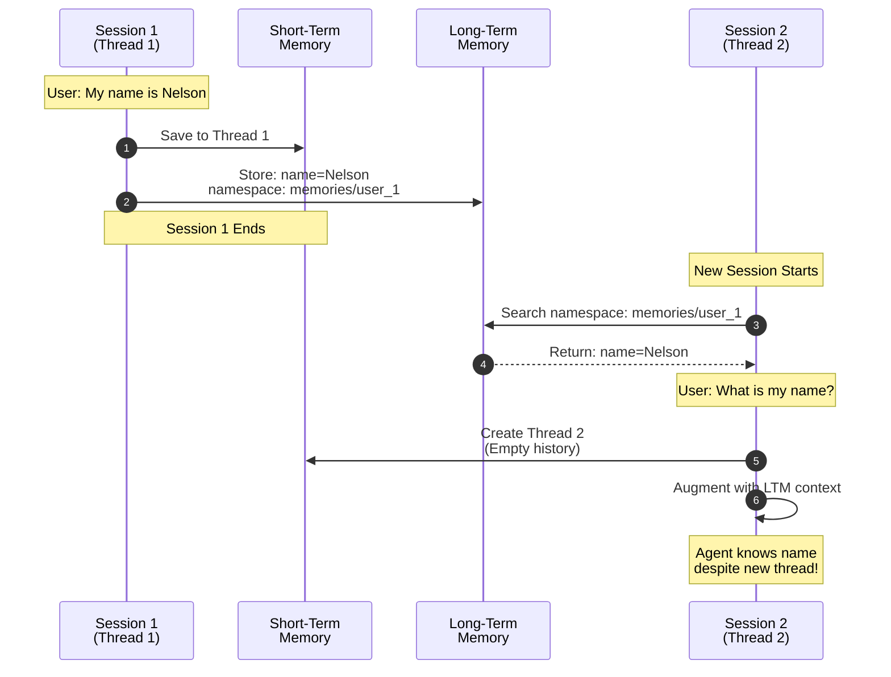

## Streaming vs Non-Streaming Flow

### Non-Streaming Flow (Default)

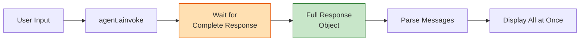

### Streaming Flow (Optional)

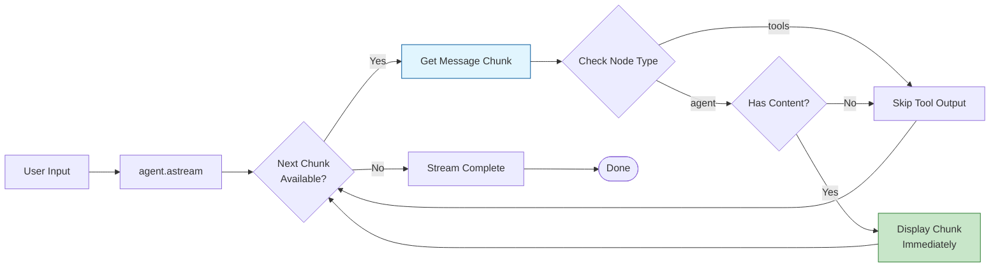

## Error Handling Flow

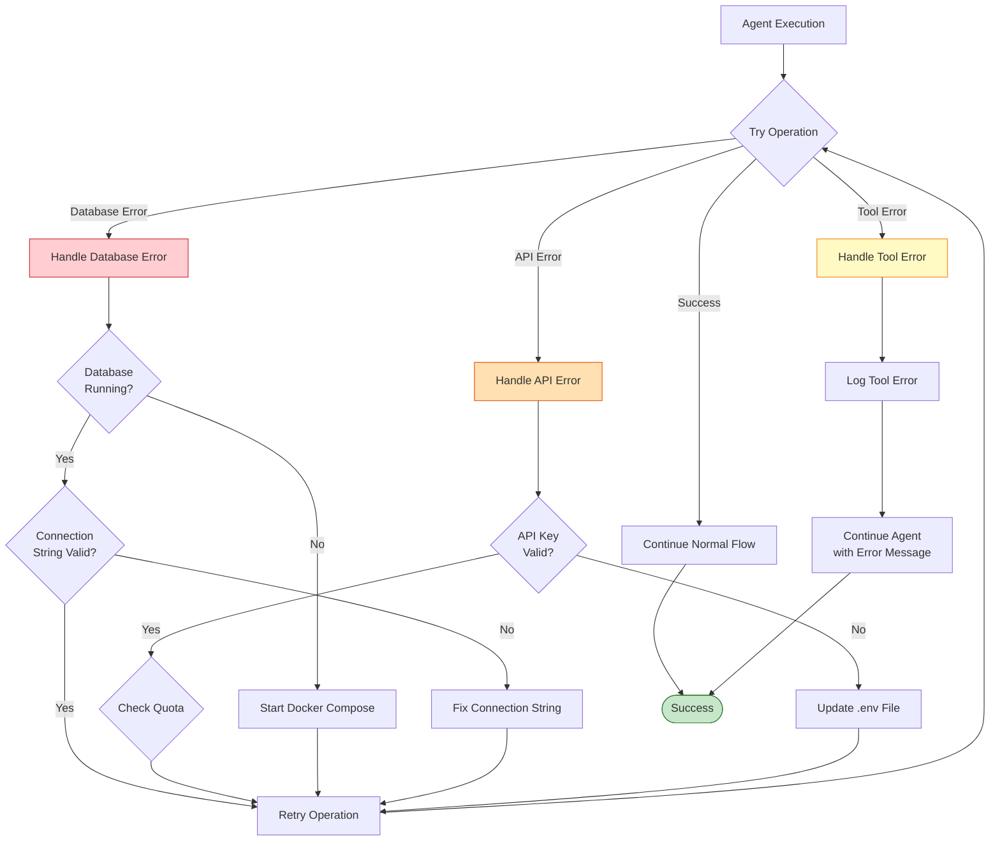

## Configuration Flow

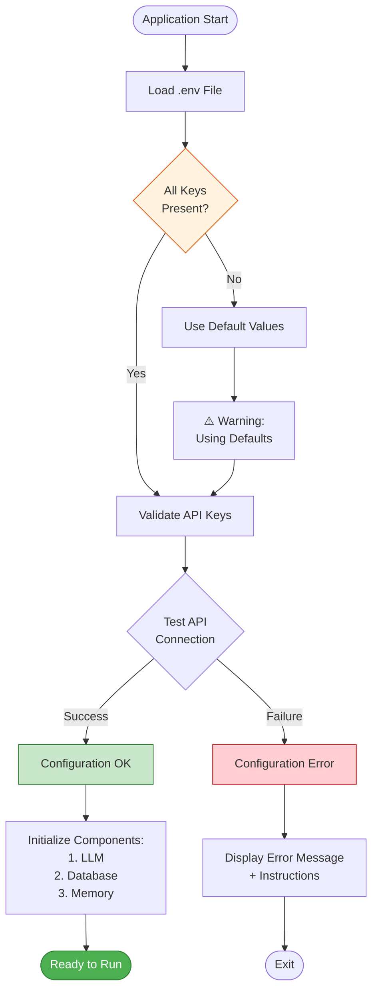
